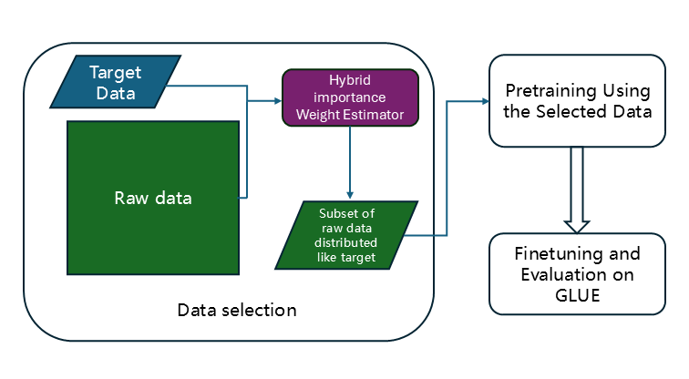

# Data Selection for Language Models via Importance Resampling (DSIR)

This repository contains the HIR data selection tool for selecting relevant language model training data from any raw data source given a target dataset, as well as pre-filtered datasets and some pretrained models.

HIR is built for:
- large-scale (trillion-token scale) data selection from large raw text dataset (Pile). 
- selecting data that is distributed like a given target dataset (domain-specific data, Wikipedia, ...) using both low-level n-gram features and high-level sentence embeddings.



## Quickstart

Install from source by cloning this repo

To select data, simply initialize a `HashedNgramDSIR` object and call the following functions:
```python
import sys
import os
sys.path.append(os.path.abspath(os.path.dirname(__file__)))
from data_selection.hashed_ngram_dsir import HashedNgramDSIR

PROJ_HOME = os.path.dirname(__file__)
data_path = os.path.join(PROJ_HOME, "tests")
raw_datasets = [os.path.join(os.path.join(data_path, "toy_data.jsonl"))]
target_datasets = [os.path.join(os.path.join(data_path, "toy_data_target.jsonl"))]
num_to_sample = 40000

dsir = HashedNgramDSIR(raw_datasets, target_datasets, cache_dir=os.path.join(PROJ_HOME, 'dsir_cache'), num_proc=1)
dsir.fit_ng_importance_estimator(num_tokens_to_fit='auto')
dsir.fit_gmm_importance_estimator()    
# uncomment to run fit_gmm_importance_estimator with pre-computed raw and text embeddings      
# dsir.fit_gmm_importance_estimator(raw_text_emb_path = dsir.cache_dir / "raw text embeddings",
#                                 target_text_emb_path = dsir.cache_dir / "target text embeddings")
dsir.compute_hybrid_importance_weight(alpha = 0.5, save_path = dsir.cache_dir / "hybrid_importance_weights_alpha_0.5.npy")
dsir.resample(log_importance_weights_path=dsir.cache_dir / "hybrid_log_importance_weights_alpha_0.5.npy",
              out_dir=os.path.join(PROJ_HOME, "outputdir/output_alpha_0.5"),
              num_to_sample=num_to_sample,
              top_k = True)
```
Running this would write 40k documents in `jsonl` files inside an output directory named `outputdir`. The files will first be written to `cache_dir` and moved to `out_dir` upon completion (set `cache_dir` to `None` to skip this step). For best performance, use uncompressed `jsonl` files stored on local file storage for all data paths and use as many CPU cores as possible, which allows each file to be virtually sharded across multiple cores. Custom functions for reading the data paths and extracting the text field from each example can be provided via the
`{raw,target}_load_dataset_fn` and `{raw,target}_parse_example_fn` arguments to the constructor. The number of tokens to use for fitting the importance weight estimator can be tuned with the `num_tokens_to_fit` argument (set to `all` to fit on full dataset). Top-k retrieval instead of sampling without replacement (the default) can be done by specifying `top_k=True` to the `resample` method.

 
The `dsir` intermediate results (after `fit_ng_importance_estimator`, `fit_gmm_importance_estimator` and `compute_hybrid_importance_weights`) can be saved and loaded for later use, for example to resample 4M documents instead:
```python
dsir.save('/path/to/dsir_params.pkl')

# later on
dsir.load('/path/to/dsir_params.pkl')
dsir.resample(out_dir='/path/to/out_dir', num_to_sample=100000000, cache_dir='/path/to/resampled_cache')
```
The `save` method can be called at any time to save partial results.

See [Usage documentation](data_selection/README.md) for full details.


## Speed benchmark on The Pile
Using 1 CPU node with 377GB RAM and 40 cores, we can select data from 1.4M subset of the Pile dataset in hours.
The Pile dataset was first decompressed and placed onto the node's local file storage. The breakdown of timings for each step are:
- *Fit n-gram importance estimator* (with `num_tokens_to_fit="auto"`): 10 hours
- *Fit gmm importance estimator*: 1 hours
- *Compute importance weights*: 0.615 second (ignored)
- *Resample 40k documents* (with `cache_dir=None` and `out_dir` is a local storage location): 0.039 hours
- *Total*: 11.039 hours

Subsequent resampling with the same target data is much faster with locally saved log importance weights.


